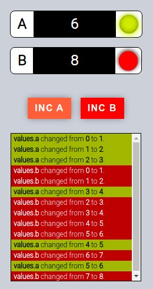

# POC Redux Subscribe



## Install dependencies

```bash
$ npm install
```

## Build

```bash
$ npm run build
```

## Run

```bash
$ npm run start
```

## Linters

### Sass Lint

```bash
$ npm run sass-lint
```

### ESLint

```bash
$ npm run eslint
```

## Tests

### Unit tests

```bash
$ npm run test
```

### Mutation tests

All files:

```bash
$ npm run stryker
```

A file:

```bash
$ npm run stryker:file src/pageComponent.js
```
